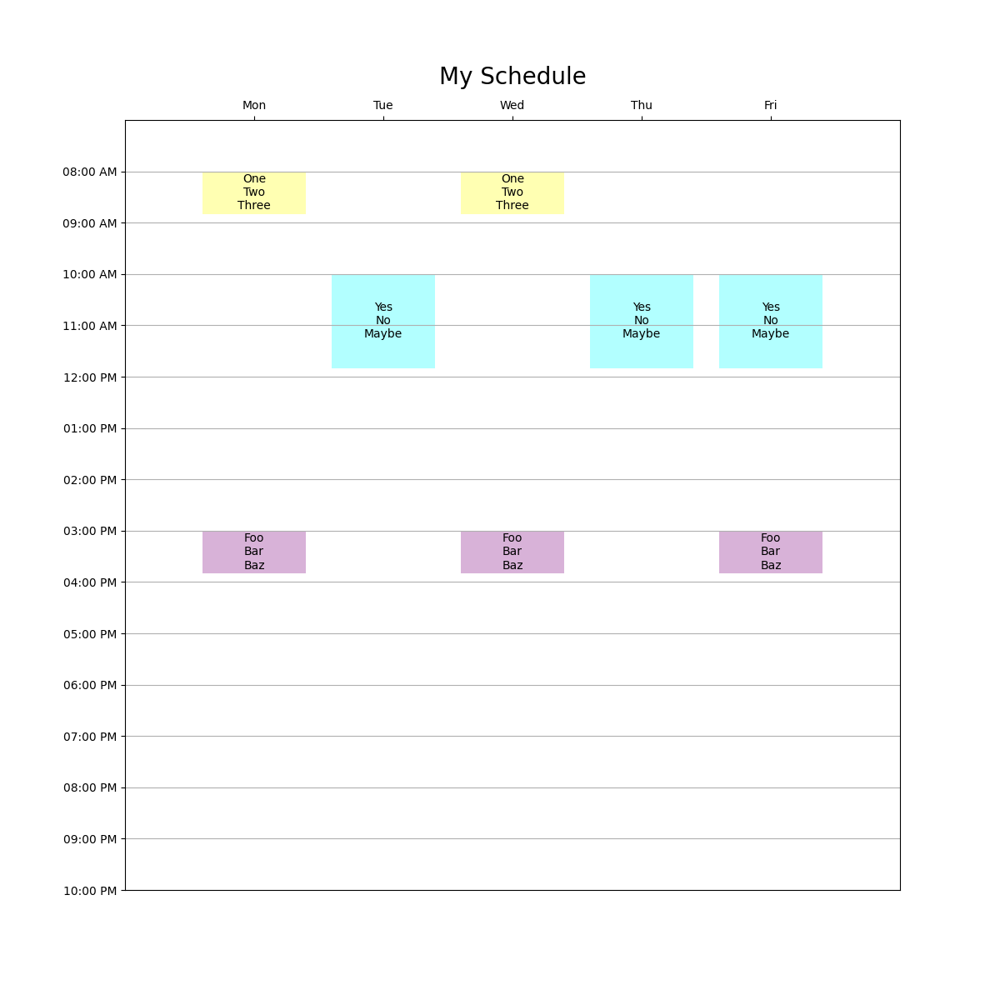

# A simple schedule plotter

The csv/xlsx file needs to have columns "begin", "end", "days", and whatever text you want in the schedule boxes:

|   | begin    | end      | days | Label1 | Label2 | Label3 | 
|---|----------|----------|------|--------|--------|--------| 
| 0 | 08:00 AM | 08:50 AM | MW   | One    | Two    | Three  | 
| 1 | 10:00 AM | 11:50 AM | TRF  | Yes    | No     | Maybe  | 
| 2 | 03:00 PM | 03:50 PM | MWF  | Foo    | Bar    | Baz    | 

For this CSV you could use this command line:

	plotschedule --output bar.png --title "My Schedule" example/foo.csv --labels Label1 Label2 Label3

And you'd get this output:

You can also add a `color` column and use matplotlib colors.

